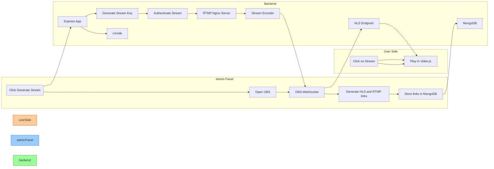

```mermaid
graph LR

subgraph User Side
  style userSide fill:#FFCC99,stroke:#E6955C,stroke-width:2px,rounded
  clickUserStream(Click on Stream) --> videojs[Play in Video.js]
end

subgraph Admin Panel
  style adminPanel fill:#99CCFF,stroke:#6FA8DC,stroke-width:2px,rounded
  clickGenerateStream(Click Generate Stream) --> obs[Open OBS]
  obs --> obsWebSocket[OBS-WebSocket]
  obsWebSocket --> generateHLSRTMP[Generate HLS and RTMP links]
  generateHLSRTMP --> storeLinks[Store links in MongoDB]
end

subgraph Backend
  style backend fill:#99FF99,stroke:#78C178,stroke-width:2px,rounded
  clickGenerateStream --> expressApp[Express App]
  expressApp --> streamKey[Generate Stream Key]
  streamKey --> authenticateStream[Authenticate Stream]
  authenticateStream --> rtmpNginxServer[RTMP Nginx Server]
  rtmpNginxServer --> ffmpeg[Stream Encoder]
  ffmpeg --> obsWebSocket
  obsWebSocket --> hlsEndpoint[HLS Endpoint]
  hlsEndpoint --> videojs
  expressApp --> linode[Linode]
  storeLinks --> mongodb[MongoDB]
end

clickUserStream --> videojs


```
