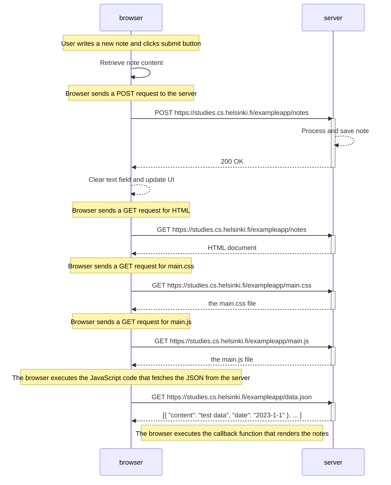

```mermaid
sequenceDiagram
    participant browser
    participant server

    Note over browser: User writes a new note and clicks submit button
    browser->>browser: Retrieve note content

    Note over browser: Browser sends a POST request to the server
    browser->>server: POST https://studies.cs.helsinki.fi/exampleapp/notes
    activate server

    server-->>server: Process and save note
    server-->>browser: 200 OK
    deactivate server

    browser-->>browser: Clear text field and update UI

    Note over browser: Browser sends a GET request for HTML
    browser->>server: GET https://studies.cs.helsinki.fi/exampleapp/notes
    activate server
    server-->>browser: HTML document
    deactivate server

    Note over browser: Browser sends a GET request for main.css
    browser->>server: GET https://studies.cs.helsinki.fi/exampleapp/main.css
    activate server
    server-->>browser: the main.css file
    deactivate server

    Note over browser: Browser sends a GET request for main.js
    browser->>server: GET https://studies.cs.helsinki.fi/exampleapp/main.js
    activate server
    server-->>browser: the main.js file
    deactivate server

    Note over browser: The browser executes the JavaScript code that fetches the JSON from the server

    browser->>server: GET https://studies.cs.helsinki.fi/exampleapp/data.json
    activate server
    server-->>browser: [{ "content": "test data", "date": "2023-1-1" }, ... ]
    deactivate server

    Note right of browser: The browser executes the callback function that renders the notes

```
