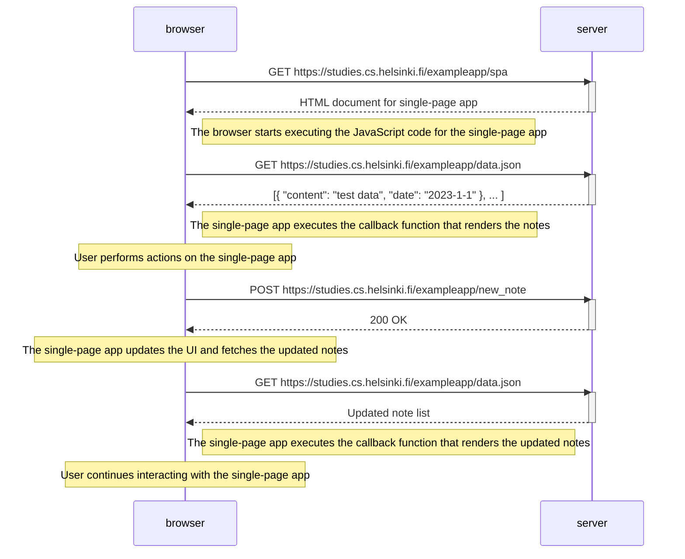

```mermaid
sequenceDiagram
    participant browser
    participant server

    browser->>server: GET https://studies.cs.helsinki.fi/exampleapp/spa
    activate server
    server-->>browser: HTML document for single-page app
    deactivate server

    Note right of browser: The browser starts executing the JavaScript code for the single-page app

    browser->>server: GET https://studies.cs.helsinki.fi/exampleapp/data.json
    activate server
    server-->>browser: [{ "content": "test data", "date": "2023-1-1" }, ... ]
    deactivate server

    Note right of browser: The single-page app executes the callback function that renders the notes

    Note over browser: User performs actions on the single-page app

    browser->>server: POST https://studies.cs.helsinki.fi/exampleapp/new_note
    activate server
    server-->>browser: 200 OK
    deactivate server

    Note over browser: The single-page app updates the UI and fetches the updated notes

    browser->>server: GET https://studies.cs.helsinki.fi/exampleapp/data.json
    activate server
    server-->>browser: Updated note list
    deactivate server

    Note right of browser: The single-page app executes the callback function that renders the updated notes

    Note over browser: User continues interacting with the single-page app

```
