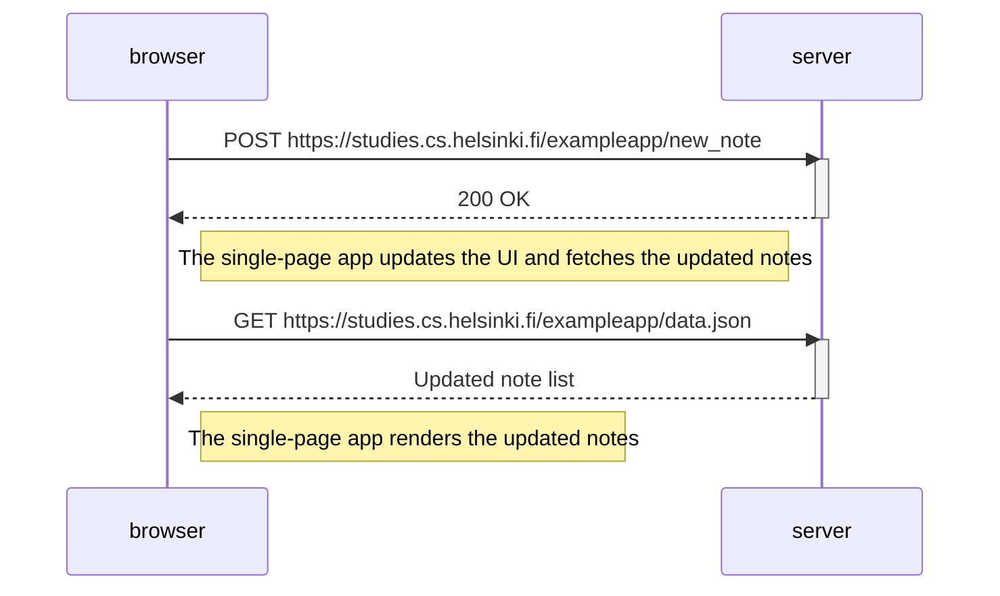

```mermaid
sequenceDiagram
    participant browser
    participant server

    browser->>server: POST https://studies.cs.helsinki.fi/exampleapp/new_note
    activate server
    server-->>browser: 200 OK
    deactivate server

    Note right of browser: The single-page app updates the UI and fetches the updated notes

    browser->>server: GET https://studies.cs.helsinki.fi/exampleapp/data.json
    activate server
    server-->>browser: Updated note list
    deactivate server

    Note right of browser: The single-page app renders the updated notes

```
